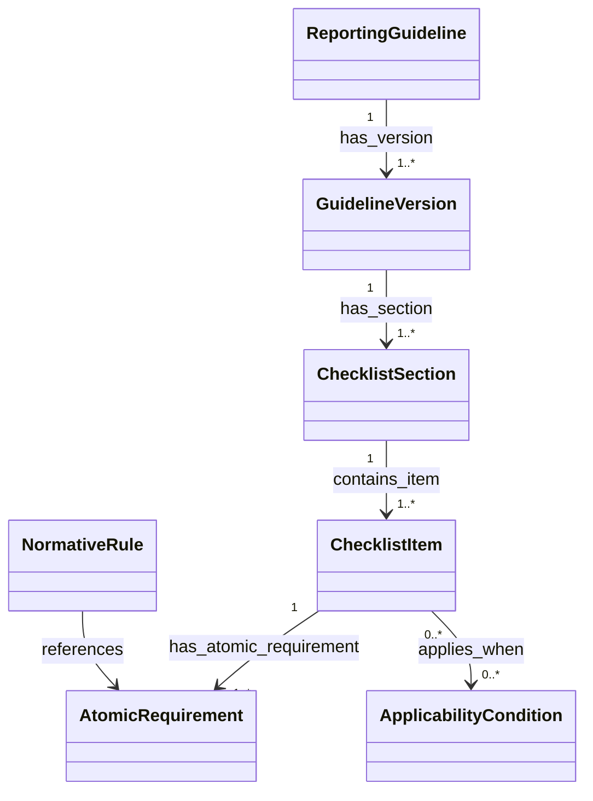

# Ontology Primer

> [!definition] Ontology
> An ontology is an explicit, structured specification of concepts in a domain, their relationships, and the constraints and rules that organize them.

| Term | Meaning here | Example |
|---|---|---|
| Class | Category of entity | `ChecklistItem` |
| Individual | Particular member of a class | `consort-2025-item-20b` |
| Attribute | Literal property | `item_number: 20b` |
| Relation | Typed connection | `has_atomic_requirement` |
| Constraint | Structural restriction | Every item has a source |
| Rule | Conditional or compositional logic | Item 20b activates if blinding occurred |
| Controlled term | Permitted vocabulary value | `conditional_must` |
| Taxonomy | Mainly a broader/narrower hierarchy | Guideline element hierarchy |
| Ontology | Taxonomy plus relations, constraints, and rules | This complete CONSORT model |

> [!example]
> `ChecklistItem` is a class. `consort-2025-item-20b` is an individual. `consort-2025-item-20b-r01` is a different individual of class `AtomicRequirement`.

See [[04 Class Catalog]], [[05 Relation Catalog]], and [[06 Rule Catalog]].
