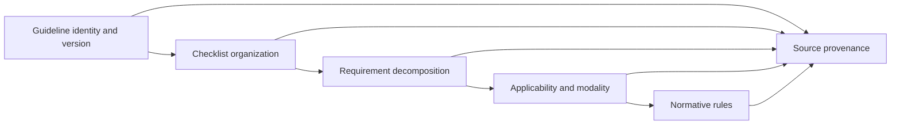

# CONSORT 2025 Ontology Overview

CONSORT is represented as a [[04 Class Catalog|ReportingGuideline]] and the 2025 release as a [[04 Class Catalog|GuidelineVersion]]. The version contains six sections, 29 topics, and 42 independently addressable checklist leaves belonging to 30 numbered items.

The ontology also defines 19 first-class trial-domain classes. [[11 Trial Domain Model]] connects the guideline requirements to trial design, arms, participants, interventions, outcomes, trial processes, participant flow, and structured results. These classes are interface definitions; Layer A does not populate trial-specific individuals.

The machine-readable model is canonical in [[08 Machine-Readable Format|_data]]. Markdown explains it and embeds exact portable item records.
