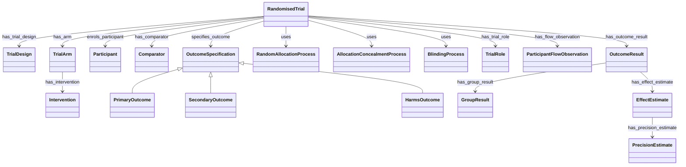

# Trial Domain Model

The following 19 concepts are first-class ontology classes with stable IDs, definitions, properties, relations, graph nodes, and individual Obsidian notes. They describe the information interface required by future evidence and validation layers. No trial-specific individuals are populated in Layer A.

## Classes

| Class | Parent | Stable ID |
|---|---|---|
| [[RandomisedTrial]] | `OntologyEntity` | `consort-class-randomised-trial` |
| [[TrialDesign]] | `OntologyEntity` | `consort-class-trial-design` |
| [[TrialArm]] | `OntologyEntity` | `consort-class-trial-arm` |
| [[Participant]] | `OntologyEntity` | `consort-class-participant` |
| [[Intervention]] | `OntologyEntity` | `consort-class-intervention` |
| [[Comparator]] | `OntologyEntity` | `consort-class-comparator` |
| [[OutcomeSpecification]] | `OntologyEntity` | `consort-class-outcome-specification` |
| [[PrimaryOutcome]] | [[OutcomeSpecification]] | `consort-class-primary-outcome` |
| [[SecondaryOutcome]] | [[OutcomeSpecification]] | `consort-class-secondary-outcome` |
| [[HarmsOutcome]] | [[OutcomeSpecification]] | `consort-class-harms-outcome` |
| [[RandomAllocationProcess]] | `OntologyEntity` | `consort-class-random-allocation-process` |
| [[AllocationConcealmentProcess]] | `OntologyEntity` | `consort-class-allocation-concealment-process` |
| [[BlindingProcess]] | `OntologyEntity` | `consort-class-blinding-process` |
| [[TrialRole]] | `OntologyEntity` | `consort-class-trial-role` |
| [[ParticipantFlowObservation]] | `OntologyEntity` | `consort-class-participant-flow-observation` |
| [[OutcomeResult]] | `OntologyEntity` | `consort-class-outcome-result` |
| [[GroupResult]] | `OntologyEntity` | `consort-class-group-result` |
| [[EffectEstimate]] | `OntologyEntity` | `consort-class-effect-estimate` |
| [[PrecisionEstimate]] | `OntologyEntity` | `consort-class-precision-estimate` |

## Core relationships

## Layer boundary

> [!warning]
> These are class definitions, not populated trial facts. Article evidence, extracted trial individuals, and validation results remain deferred to later layers.
